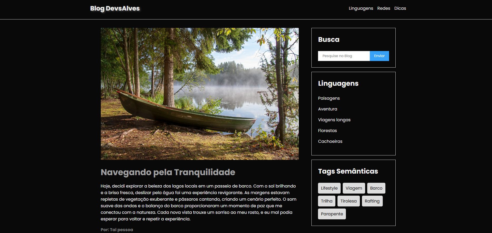

# Blog

  

> Fiz esse projeto para praticar minhas habilidades, pois estou estudando Java script. 

## ⚙️ Ajustes e melhorias

O projeto ainda está em desenvolvimento e as próximas atualizações serão voltadas para as seguintes tarefas:

- [x] Adicionar mais animações
- [x] Acrescentar mais funcionalidades com Java Script
- [x] Criar mais páginas

## 💻 Linguagens

## 📝 Liçencas 
<ul> 
  <li> As imagens utilizadas neste projeto foram obtidas no <a href="https://pixabay.com/">Pixabay</a> </li>
  <li> O setup inicial do projeto foi desenvolvido pelo <a href="https://horadecodar.com.br/"> Matheus Battisti </a> </li>
</ul>

